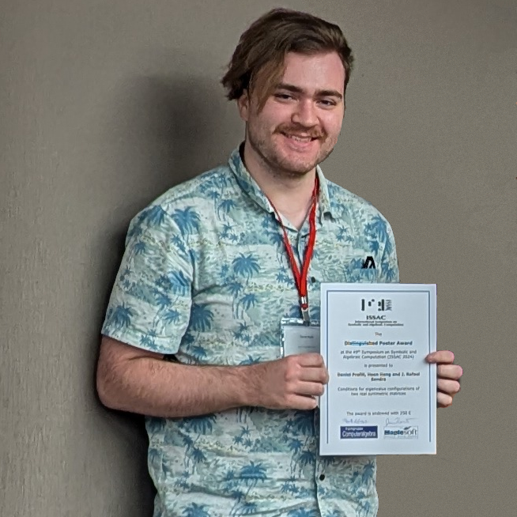

<figure class="image">
  
  <figcaption style="text-align: center; margin-block: 20px;
  font-variant: all-small-caps">ISSAC 2024 Distinguished Poster Award</figcaption>
</figure>
# About

My name is Daniel Profili, and I am a mathematics PhD candidate at
NC State University. My advisor is [Hoon Hong](https://hong.math.ncsu.edu/).

# Contact

You can reach me at `daprofil@ncsu.edu`.

# Research

My research interests are, broadly, the computational aspects of real
algebraic geometry. My PhD research, with [Hoon
Hong](https://hong.math.ncsu.edu/) and [J. Rafael
Sendra](https://www.cunef.edu/en/sendra-pons-juan-rafael/), is about generalizing Descartes' rule of signs. 

<!-- In the past I've been involved in a project [using neural networks to simulate molecular interactions](https://github.com/danielprofili/quantum-chemistry-neuralnetwork) and another project in which I helped [design algorithms for processing ultrasound images](https://pubs.acs.org/doi/full/10.1021/acs.nanolett.7b02105). -->
<!-- My [undergraduate thesis](https://smartech.gatech.edu/bitstream/handle/1853/64862/PROFILI-UNDERGRADUATERESEARCHOPTIONTHESIS-2021.pdf?sequence=1) was about the combinatorial structure of certain polytopes in 4 and 5 dimensions, which you can read about [here](https://danielprofili.github.io/research.html). -->

# Publications

1. Hong, Hoon, **Daniel Profili**, and J. Rafael Sendra. "Conditions for eigenvalue configurations of two real symmetric matrices: a symmetric function approach." arXiv preprint arXiv:2401.00089 (2023).
2. Hong, Hoon, **Daniel Profili**, and J. Rafael Sendra. "Conditions for eigenvalue configurations of two real symmetric matrices: a signature approach." arXiv preprint arXiv:2401.00086 (2023).

3. Copper Sulfide Perfluorocarbon Nanodroplets as Clinically Relevant Photoacoustic/Ultrasound Imaging Agents,
    Daniela Y. Santiesteban, Diego S. Dumani, **Daniel Profili**, and Stanislav Y. Emelianov,
    Nano Letters 2017 17 (10), 5984-5989,
    DOI: 10.1021/acs.nanolett.7b02105.
