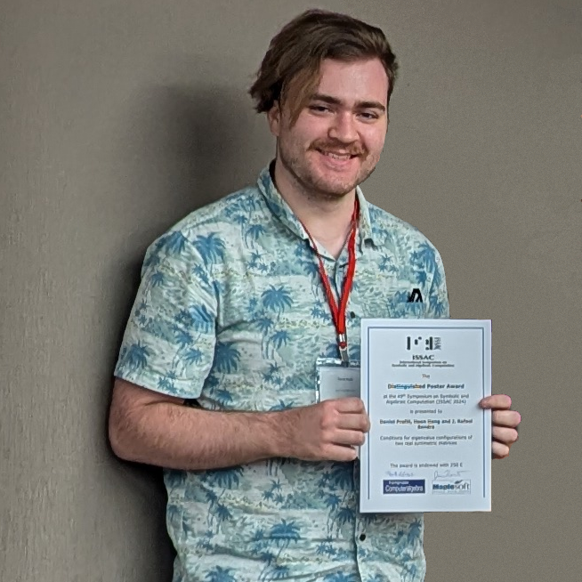

<figure class="image">
  
  <figcaption style="text-align: center; margin-block: 20px;
  font-variant: all-small-caps"><a href="./resources/issac.pdf">ISSAC 2024 Distinguished Poster Award</a></figcaption>
</figure>
# About

My name is Daniel Profili, and I am a recent PhD graduate in
mathematics. I studied at North Carolina State University and my
advisor was Professor Hoon Hong.

My research interests are symbolic computation, constructive real algebraic
geometry, and mathematical software development. My
[PhD dissertation](https://repository.lib.ncsu.edu/items/77838cd8-4fb0-4a46-990b-1a2bf5bac96d)
is about designing algorithms to efficiently generate conditions on
parametric matrices so that their eigenvalues are arranged in a given order.

More broadly, I am interested in developing mathematical and scientific
[software](https://danielprofili.github.io/software.html) bridging
mathematics and interdisciplinary areas so that mathematics can be more accessible.
<!-- In the past I've been involved in a project [using neural networks to simulate molecular interactions](https://github.com/danielprofili/quantum-chemistry-neuralnetwork) and another project in which I helped [design algorithms for processing ultrasound images](https://pubs.acs.org/doi/full/10.1021/acs.nanolett.7b02105). -->
<!-- My [undergraduate thesis](https://smartech.gatech.edu/bitstream/handle/1853/64862/PROFILI-UNDERGRADUATERESEARCHOPTIONTHESIS-2021.pdf?sequence=1) was about the combinatorial structure of certain polytopes in 4 and 5 dimensions, which you can read about [here](https://danielprofili.github.io/research.html). -->

# [Publications](https://scholar.google.com/citations?user=XMcNBrMAAAAJ&hl=en&oi=ao)

1. Hong, Hoon, **Daniel Profili**, and J. Rafael Sendra. ["Conditions
   for eigenvalue configurations of two real symmetric matrices
   (signature approach)."](https://arxiv.org/pdf/2401.00866).
    SIAM Journal on Matrix Analysis and Applications (pending). (2026).
2. Hong, Hoon, **Daniel Profili**, and J. Rafael Sendra. ["Conditions
   for eigenvalue configurations of two real symmetric matrices
   (symmetric polynomials approach)."](https://arxiv.org/pdf/2401.00089)
   Journal of Symbolic Computation (pending) (2026).
3. Santiesteban, Daniela Y., Diego S. Dumani, **Daniel Profili**, and
    Stanislav Y. Emelianov. [Copper Sulfide Perfluorocarbon
    Nanodroplets as Clinically Relevant Photoacoustic/Ultrasound
    Imaging Agents.](https://pubs.acs.org/doi/full/10.1021/acs.nanolett.7b02105?casa_token=U2MQdvX9mjAAAAAA%3AVTy41CqBwCQW_NnERF7OsMvtEhr1aR1xQnU_h2lxluLqTEO3_l4ZbM_7bxVuNgxua3D_vTufxpjUk1Br) Nano Letters 2017 17 (10), 5984-5989,
    DOI: 10.1021/acs.nanolett.7b02105.
