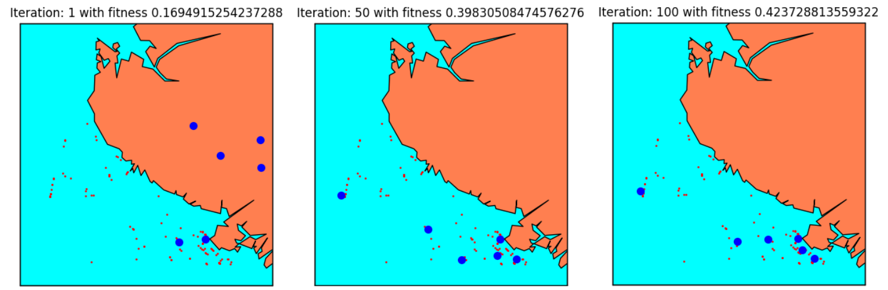
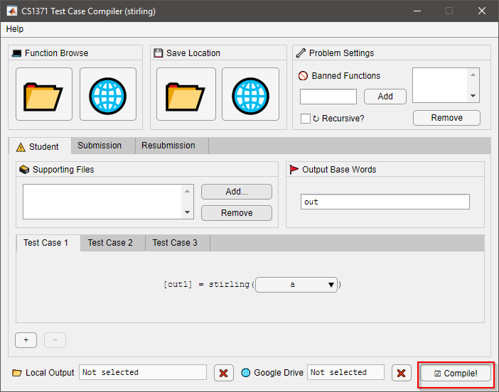
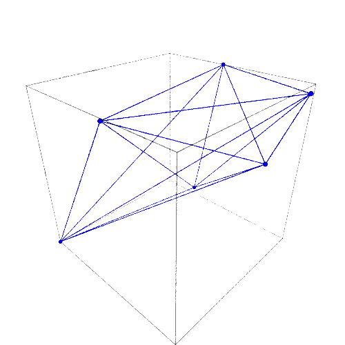

# Software

<h2 style="font-family: monospace, monospace;"> AISRouteFinder </h2>

 
<figure class="image">
  
  <!-- <figcaption style="text-align: center; margin-block: 20px;">Genetic -->
  <!-- algorithm in action</figcaption> -->
</figure>

**`AISRouteFinder`** is an application which learns aggregate maritime
traffic routes. It is implemented in Python and uses Apache Spark and
cluster computing to generate maritime traffic graphs from a very
large number
(>2 million) of input AIS (automatic identfication system) data
points.  

<!-- ## `ECSignature` -->
<h2 style="font-family: monospace, monospace;"> ECSignature </h2>

**`ECSignature`** is a symbolic computation algorithm which takes as
input two symbolic matrices and a desired arrangement (ordering) of
their eigenvalues, and gives as output a condition on the matrix
entries so that their eigenvalues are arranged according to the input
arrangement. It is implemented in the computer algebra system Maple
and relies on the theory of the signature of matrices.  

<!-- ## `ECSymmetry` -->
<h2 style="font-family: monospace, monospace;"> ECSymmetry </h2>

**`ECSymmetry`** is a symbolic computation algorithm which takes as
input two symbolic matrices and a desired arrangement (ordering) of
their eigenvalues, and gives as output a condition on the matrix
entries so that their eigenvalues are arranged according to the input
arrangement. It is implemented in the computer algebra system Maple
and relies on the theory of symmetric polynomials.  

<!-- ## `Test Case Compiler` -->
<h2 style="font-family: monospace, monospace;"> Test Case Compiler </h2>

 
<figure class="image">
  
  <!-- <figcaption style="text-align: center; margin-block: 20px;">Test Case Compiler user interface</figcaption> -->
</figure>

The **Test Case Compiler** is a software tool designed for teaching assistants for the
course CS 1371 (Computing for Engineers) at Georgia Tech. Its
purpose is to package and create automated grading rubrics for coding
homework problems.  

<!-- ## `fvectors` -->
<h2 style="font-family: monospace, monospace;"> fvectors </h2>
 
<figure class="image">
  
  <!-- <figcaption style="text-align: center; margin-block: 20px;">Test Case Compiler user interface</figcaption> -->
</figure>

**`fvectors`** is a Python/SageMath tool used to study the
combinatorial properties of higher-dimensional geometric objects which
arise from abstract algebra.
